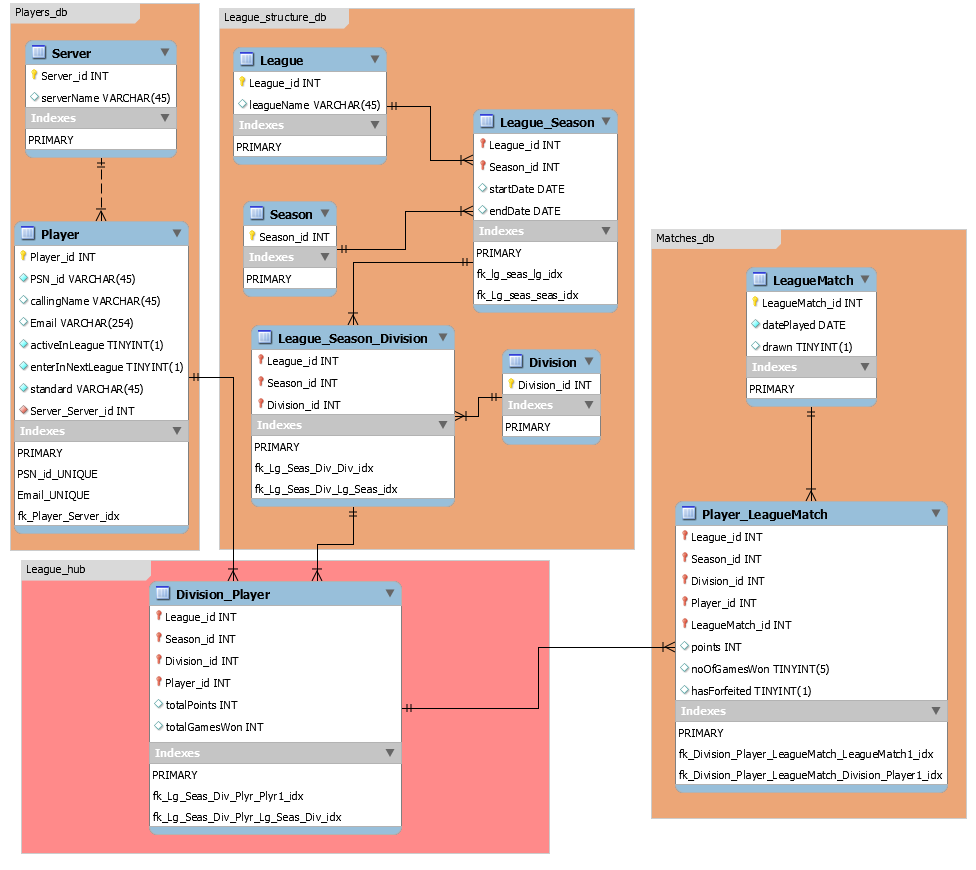

  # **Racket Fury PSVR Online League and Community Project**
  

  ## __CONTENTS__

1. [ABOUT THE PROJECT](#about-the-project)
    1. [What is this Project?](#what-is-this-project)
    1. [Why is this project needed?](#why-is-this-project-needed)
    1. [Is there enough demand for this project?](#is-there-enough-demand-for-this-project)
    1. [How will this league be made known to Racket Fury PSVR owners?](#how-will-this-league-be-made-known-to-racket-fury-psvr-owners)
    1. [How will the leagues work?](#how-will-the-leagues-work)
    1. [What if a player doesn't want to enter leagues but wants to just arrange friendlies?](#what-if-a-player-doesn't-want-to-enter-leagues-but-wants-to-just-arrange-friendlies)

1. [CODING IMPLEMENTATION](#CODING-IMPLEMENTATION)
    1. [Development Environment  Details](#Development-Environment-Details)
    1. [Priority features and functions to implement for this project](#Priority-features-and-functions-to-implement-for-this-project)
    1. [Additional features for future](#Additional-features-for-future)
    1. [Backend Main Github Files and their description](#Backend-Main-Github-Files-and-their-description)
    1. [Front End Main Github files and their description](#Front-End-Main-Github-files-and-their-description)

1. [RESOURCES USED FOR THIS PROJECT](#RESOURCES-USED-FOR-THIS-PROJECT)
    1. [Installing MySQL on Windows 10 instructions](#Installing-MySQL-on-Windows-10-instructions)
    1. [Installing PHP on Windows 10](#Installing-PHP-on-Windows-10)
    1. [Learning Material](#Learning-Material)

1. [NOTABLE TROUBLESHOOTING AND SOLUTIONS](#NOTABLE-TROUBLESHOOTING-AND-SOLUTIONS)

 

## __ABOUT THE PROJECT__
 

### __What is this project?__
 
This is a non profit, no ads community website passion project for Racket Fury PSVR online PSN players to connect with other online PSVR players and arrange friendly or league matches together.  In addition to providing a database of PSN players, the project also establishes a "Box style" league system, divided into divisions of up to 7 players each, that gives all standard of players an opportunity to enter and become a winner of their own division.  Every season lasts for 3 weeks and a new season starts a few days after.  This gives all players a new fresh start to win in their division.  Aside from the leagues, players can  just utilise the database of players to arrange friendly sessions if they don't wish to enter leagues.  
  

### __Why is this project needed?__

  
The virtual reality game, Racket Fury on Playstation VR (PSVR) is arguably the most realistic simulation of playing table tennis with other players online.  When players find a game online, the physical energy exerted is close to playing the real sport and serves as a great fitness activity that has the added incentive of competition. 
  
However, the game lacks competitive features such as leaderboard, leagues, tournaments and a record of matches played.  There is little incentive for players to play online and it is evident that there is a lack of players going online.  Furthermore, the online play feature was a very late update, that arrived a year after the release of the game. That means many owners are unaware of the online feature. 
  
The developers of the game are a small team and are no longer focussed on providing updates for the PSVR version at least for the foreseeable future.  They are now focussed, understandably, on the more substantial userbase of the Oculus Quest version.  
 
So this project hopefully fills that gap to serve the online RF community with a hub to compete in leagues and arrange friendly or league matches with each other.
  

### __Is there enough demand for this project?__
 
Although there isn't many players online, there are signs that there is a demand.  Though how much is an uncertainty.   On the Racket Fury PSN community groups, there are around 60 players who have posted asking for a game with anyone.  There have also been a further 40 players expressing interest on the Reddit PSVR subforum.  The problem with PSN game communities is that Sony Playstation has deactivated the smartphone app PSN community messaging service, so communication can only be done via the PS4 console UI which is not easy to do without a keyboard.   This project aims to deliver an easier communication method without users needing to enter any personal email or comms details.  
  

### __How will this league be made known to Racket Fury PSVR owners?__
 
Will post announcement of project going live through 

* Reddit PSVR subforum
* AVFoums PSVR forum
* Message all PSN users on the Racket Fury PSN communities groups.  

An accompanying social media accounts will also be setup.

 

### __How will the leagues work?__
  

Each world server (eg Europe, Japan, USA etc) will have a league that runs in consecutive seasons,  each season lasting for 3 weeks.  It is not practical to have a worldwide league because opponents on different servers to their own, results in too much lag for the game to be playable.  However, there may be a pairing of servers (sucha as USA EAST and USA WEST servers) that have sufficiently low lag between them so that they can be combined into one league but ping rates need to be tested before deciding to merge servers into a league.
  
The league is divided into divisions, where each division contains up to 7 players of a similar standard.  Each player plays one match against all other players in their division before the season ends.  A win rewards the player 3 points, losing a game rewards the player 1 point, a draw rewards both players 2 points.  Points are not rewarded for unplayed games, nor to any player that forfeits a game.  If a player forfeits a game, the opponent will be rewarded 3 points. 
  
League matches are played in a best out of five games format.  In other words, the winner of a league match is the first player to win 3 games.  The games won is recorded onto the league database via a match results entry form on the website. If for some valid reason, the match was not completed and could not be resumed on another day, then the match must be recorded as a draw.   Players will be encouraged to video record their match from the start, using the PS4's game quick recording facility (actioned by double-clicking the share button on the move controller.  Double-clicking the share button again after the match will end the recording) in case disputes occur on the number of games won.  Players will be advised to set the default recording length to maximum one hour on the PS4 Settings Menu as the default length is probably 15 minutes.  Players will also be advised to keep the video recordings of a match for at least 3 days after results submission giving time for the opponent to dispute. 
  
At the end of every season, the top two players with the most points in each division promote up a division (except for the top division) and bottom two demotes to lower-division (except for lowest division).  If the 2nd and 3rd highest points are equal, then 2nd place is determined by who played the most matches.  If number of matches played is also equal, then 2nd place is determined by whoever has the larger game won-lost game difference.   

So if player A games were as follows:

|Match   | Result  | Points reward |
|--------|---------|---------------|
|Match 1:| won 3-1 |  3 points     |
|Match 2:| won 3-1 |  3 points     |
|Match 3:| lost 2-3|  1 point      |
|Match 4:| won 3-0 |  3 points     |
 
and for Player B:
  

|Match   | Result  | Points reward |
|--------|---------|---------------|
|Match 1:| won 3-2 |  3 points     |
|Match 2:| won 3-1 |  3 points     |
|Match 3:| draw    |  2 points     |
|Match 4:| draw    |  2 points     |
 

both have 10 points, both played 4 matches but player A has the larger games difference (11-5=6) compared to Player B (6-3). So Player A takes the second place and promotes to next division in the next season.  The same principle applies to the players at the bottom of the division. 
  
In the event that the 2nd and 3rd place have same points, played the same number of games and have the same game difference, then in this exceptional circumstance, top 3 players will promote to the next division and bottom 3 players of that division will be demoted. 
  
Unlike video game leaderboards, this structure rewards players of all standards the opportunity to be a winner in their own division as the aim is to match players of a similar standard.   All division winners at the end of every season will be posted onto the website and on social media such as Facebook.
  
The first season will not be perfect in grouping similar standards but as the seasons continue and players get promoted/demoted, players will, by nature of the box league structure, progress to the appropriate division of their playing standard.

  

### __What if a player doesn't want to enter leagues but wants to just arrange friendlies?__
 
Anyone can use the Player database to find a player that is on their server.  Players who register will include their PSN ID, server and initial self-assessed standard (Good, intermediate and Beginner).  This is all the information needed to register on the database.  On registering, players will be recommended to also submit their email address (private) so that the league organiser can send notifications of the new season start dates and announcements of the end of season results. 
  

## __CODING IMPLEMENTATION__
 

### __Development environment details__
 
Whole project is developped on a Windows 10 local machine.
  
The relational database of the league and players structure is developed with MySQL Workbench.  PHP is the chosen language to query the database at the backend.  HTML5, CSS, CSS Grid, and Javascript is used for frontend development due to the level of knowledge and current learning curve of the developer (Tej Dyal).  During development on a local Windows 10 machine, both PHP and MySQL are installed natively as each have their own local host server function and both have a Windows 10 install.  This means no additonal server emulation base was needed (such as Apache).  Local development environment such as WAMP, XAMPP, MAMP are not needed...at least so far.  See Resources used section for how php was installed on Windows.
  
VSCODE is used as the editor for HTML5/CSS, javascript and PHP. 
MySQL Workbench is the UI for database managment, design, creation and queries testing.

  

### __Priority features and functions to implement for this project__

 

* Store all-league and player information into a relational database.

* Show league current status and results history

* Show Player standings in current divisions

* Show Players match history and positions through seasons

* Show players DB specific to the requested server.

* User form for registering their profile.

* User form for entering match results.

  

### __Additional features for future__
 

* Internal messaging system to challenge players.

* Players can record their non-league matches results.

 

### __Backend Main Github Files and their description__
 

EER relational DB model diagram (created in MySQL Workbench):  

  
MySQL  Workbench file: 
"Racket Fury League Model V2.mwb"

Forward engineered MySQL script (the creation of the dB): 
"rf_league_db_forward engineer.sql"

The above DB creation script is built upon further over the project development with modifying db scripts contained in this folder:
"Modifying structure queries since original EER forward engineering"

So if wanting to create a duplicate of the current database structure via SQL script, execute "rf_league_db_forward engineer.sql" and then the scripts in the above folder.

Folder: "Data queries" contain several queries to test the functioning of the database
Folder: "db data and structure dump"  is the backup database structure and test data.  

Test data simulation spreadsheet of two different leagues running for one season : 
"one season simulation of league results.ods"

 

### __Front End Main Github files and their description__
 
(NOTE: Front end is very underdeveloped but this is a skeletal structure of the intended result.)

Main home page showing links and buttons to the site's features: 
"index.php"

  

## __RESOURCES USED FOR THIS PROJECT__

 

### __Installing MySQL on Windows 10 instructions__

https://youtu.be/u96rVINbAUI

### __Installing PHP on Windows 10__

https://www.edureka.co/blog/how-to-install-php-on-windows/

In case above website ceases, here is a quick summarry of the install:   
download threaded 64 bit latest version (v7.4.9 at time of writing this) for Windows from official PHP site. 
Unzip to c:\PHP7 (or anywhere of your choosing). 
Include this path in System Environment Variables (steps as follows:): 
System Properties->Environement Variables 
In System Variables section, double click on Path 
click New 
type C:\PHP7 
click OK to everything as you cascade backwards through the window pop ups.

MYSQLi is the chosen connectivity protocol used between PHP and MySQL. 
To achieve this on Windows install: 
rename the php.ini-development file in the PHP7 directory to php.ini.   
Uncomment the following two lines by removing semicolon: (use CTRL-F to find keywords "extension_dir" and "mysqli" to find the two lines quickly)  

extension_dir = "ext" 

extension=mysqli

That completes the PHP install and connectivity with MySQL.
  

### __Learning Material__
 
Learning normalisation and DB theory: 

https://youtu.be/l5DCnCzDb8g 
https://youtu.be/UrYLYV7WSHM

Understanding Many to Many relationship in clarity: 
https://youtu.be/1eUn6lsZ7c4

Learning to create a database by visual design using MySQL Workbench EER diagram mode: 
https://youtu.be/HusL582R2TY 
https://youtu.be/w-0IWyAeZ3M 
https://youtu.be/K6w0bZjl_Lw 

Workbench Forward engineering tutorial: 
https://youtu.be/1sqhDJae-xY 
https://youtu.be/uKwR9fWsZJ4

Learning MYSQL queries 
https://youtu.be/7S_tz1z_5bA 
https://www.w3schools.com/sql/default.asp 

Learning PHP 
https://www.w3schools.com/php/default.asp 

Learning PHP in application to MySQL by building a fill social Network site 
https://www.udemy.com/course/make-a-social-media-website/   

Learning HTML5, CSS, Frameworks (Materialize), Flex Box, CSS Grid, and Javascript 
https://www.udemy.com/course/learn-html5-programming-from-scratch/ 

Understanding complete Regular Expressions(REGEX) 
https://www.youtube.com/watch?v=sa-TUpSx1JA 

Tool for testing REGEX 
https://regex101.com/r/OykR4H/1 

## __NOTABLE TROUBLESHOOTING AND SOLUTIONS__

There is a bug in SQL Workbench where the EER diagrams fails to show the composit FK/PK symbols on tables which makes the EER diagram useless for  presentation.  This bug has never been fixed and may not ever be fixed as it isnt marked as a priority by the developers. However, Github user, horeca2 had solved the problem and published a simple fix here  

https://github.com/horeca2/MySQL-Workbench-Bug-92141-patch

Following theses instructions successfully fixed the problem, so can present a perfectly illustrated EER diagram of the project as shown above.

DIscussion of the annoying bug here:
https://bugs.mysql.com/bug.php?id=92141